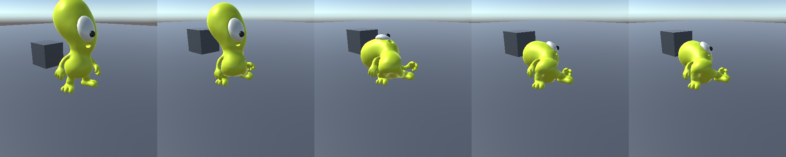
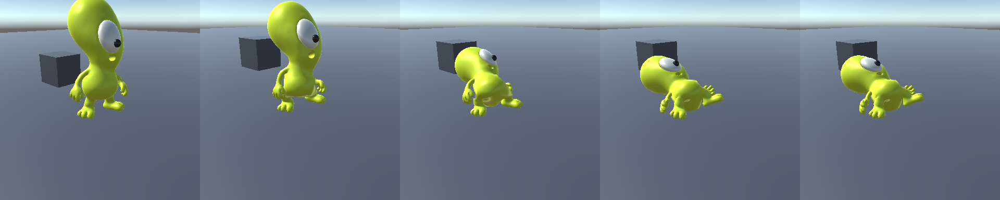
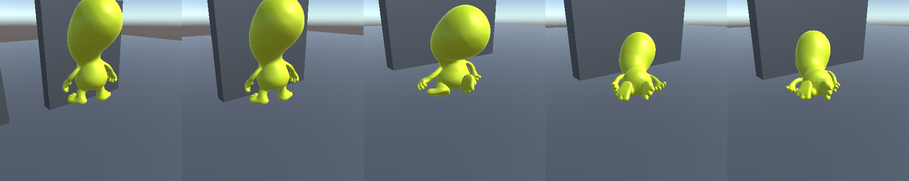
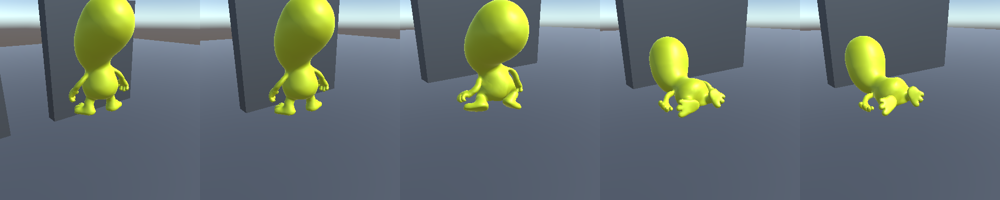
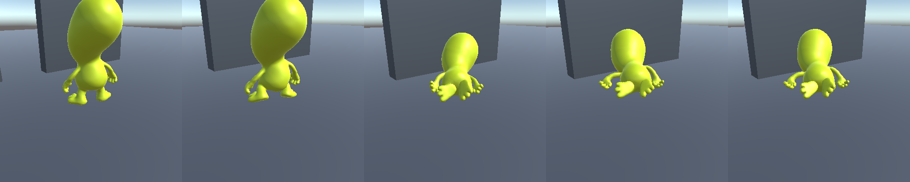
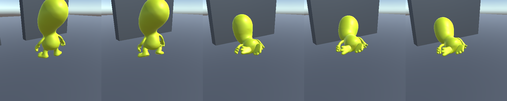

# 축을 고치고 한계를 안 고쳐서 더 심해진 붕괴 (v1)

> 상태: `game-tech-director` · `2026-08-21` · 카드 `c0672ad5` (`12506297` 재오픈)
> 증상: `LAST_SHIFT_RAGDOLL_LAB` 을 Play 하면 승무원이 넘어지면서 몸통이 공처럼 뭉치고 다리가 안 보인다.
> **직전 수정(`1764aa9`) 뒤에 더 심해졌다.**
>
> 같은 카드의 앞선 두 건: [축 정렬](last-shift-ragdoll-joint-frame-collapse-v1.md) · [스킨 늘어남](last-shift-ragdoll-fall-mesh-collapse-v1.md)

---

## 0. 결론 먼저

1. **반쪽만 고쳤다.** `1764aa9` 는 조인트 축을 뼈에 맞추면서 **한계 숫자는 일부러 안 건드렸다**
   ("축과 한계를 한꺼번에 바꾸면 나아졌는지 나빠졌는지를 못 가른다"). 그런데 그 숫자들은
   축이 78도 어긋나 있던 때 손으로 잡은 값이다 — 축을 돌리면 **같은 숫자가 다른 자유도에 걸린다.**
2. **엉덩이에서 그 차이가 컸다.** 옛 축에서 "굽힘" 이던 비틀림 `-20..70`(90도)이, 축을 고친 뒤로는
   **넓적다리를 제 축 둘레로 90도 돌리는 허가**가 됐다. 무릎 경첩이 그 돌아간 평면을 따라 접히니
   다리가 개구리처럼 옆으로 퍼진다. 실측에서 넘어질 때마다 엉덩이 비틀림이 정확히 그 `70` 도
   끝에서 멈췄다 — 뚫린 것이 아니라 **열어 준 만큼 간 것**이다.
3. **반대쪽 스윙 콘은 너무 좁아 못 지킨다.** 엉덩이 스윙 `30/10` 중 10도짜리가 **47도까지** 뚫렸다.
   솔버 반복을 `40/16` 까지 올려도, TGS 로 바꿔도, 전처리를 켜도 안 잡혔다(§3).
4. **검사가 이것을 못 봤다.** 기존 자는 상대 회전의 **크기 하나**를 `max(스윙)+max(비틀림)` 합계
   예산에 나눈다. 엉덩이 예산이 100도가 되니 **스윙으로 56도 벌어져도 "0.56배 — 한계 안"** 이다.
   자유도를 안 나누면 새는 자유도를 못 본다.
5. **바디 설정이 Unity 기본값이었다.** 리지드바디의 솔버 반복·디페네트레이션 상한은 **직렬화되지
   않아서** 손으로 얹은 프리팹은 코드가 넣어 주지 않으면 기본값(`6/1` · `10 m/s`)으로 돈다.
   `10 m/s` 는 `LastShiftRagdollTuning` 주석이 "이 승무원에게는 너무 커서 래그돌이 터진다" 고
   이미 적어 둔 값이다.
6. **고친 뒤:** 자유도별 최악 초과 `56.9도 → 22.1~24.6도`(두 번 돌린 값). 발목 `56.9 → 10.0`, 무릎 축 밖 `21.4 → 7.9`.
   그냥 넘어뜨리는 경우(사용자가 Play 만 누르는 그것) 정착 시 다리 뻗음이 `0.69 → 1.00` 으로
   완전히 펴진다. 그림은 §4.

---

## 1. 무엇을 잘못 쟀나

`LastShiftRagdollStressProbe.JointTracker` 와 `LastShiftRagdollJointFrameTests` 가 쓰던 자:

```
overshoot = angle(정지→현재 상대회전) / ( max(swing1, swing2) + max(|twistLow|, |twistHigh|) )
```

분모가 **합계**라 자유도가 섞인다. 엉덩이(`swing 30/10`, `twist -20..70`)의 예산은 100도가 되고,
다리가 스윙으로 56도 벌어져도 `0.56배` 로 찍힌다. 실제로 `1764aa9` 의 완료 보고에 적힌
"최대 초과 1.38~1.64배" 가 이 자로 잰 값이다 — **그 사이 화면에서는 다리가 퍼져 있었다.**

`LastShiftRagdollJointLimitTracker`(런타임)를 새로 두고 상대 회전을 조인트 프레임에서
**비틀림 · 스윙1 · 스윙2 로 분해**해 각각 제 한계와 견준다. 경첩은 축 둘레 각과 **축 밖으로 샌 각**을
따로 적는다 — 경첩에는 축 밖 자유도가 아예 없으므로 거기서 나온 각은 한계가 넓은 것이 아니라
솔버가 못 버틴 것이다.

> **비틀림 부호는 뒤집어 견준다.** Unity 의 `lowTwistLimit`/`highTwistLimit` 는 이 축 둘레 각과
> 부호가 반대다. 솔버 반복 6/20/40 세 벌 모두에서 멈추는 자리가 정확히 반대 부호의 경계였다 —
> 엉덩이 `-20..70` 이 `-70.2`, 어깨 `-50..10` 이 `+50.6`, 목 `-10..5` 가 `+10.3`.
> 안 뒤집으면 **한계를 지키고 있는 관절이 50도씩 새는 것으로** 찍힌다. `HingeJoint` 는 그대로다.

측정은 에디터를 안 띄우고 돈다:

```powershell
unity run "<Project>" -- -nographics -logFile tmp/collapse.log `
  -executeMethod DoodleUp.Editor.LastShiftRagdollCollapseProbe.RunForAutomation -collapseTag fix
```

---

## 2. 기각된 원인 — 다시 훑지 말 것

### 2.1 몸통이 실제로 눌린 것은 아니다

골반→머리 거리는 세 시나리오 전부에서 **0.97 이하로 안 내려갔다**(정지 대비). 척추는 안 눌린다.
사용자가 본 "배가 공처럼 뭉쳤다" 는 **팔다리가 접혀 실루엣에서 사라진 것**이지 몸통 압축이 아니다.
그래서 스킨(`LastShiftRagdollSkinFollow`)은 이 건과 무관하다 — 그쪽은 손대지 않았다.

### 2.2 솔버를 세게 해도 안 잡힌다 (2026-08-21 실측)

`drop` 시나리오, 자유도별 최악 초과(도):

| 설정 | 최악 초과 | 어디 |
|---|---|---|
| 기본 (`6/1`) | **56.9** | 발목 스윙1 |
| `20/8` | 28.4 | 발목 스윙1 |
| `40/16` | **59.7** | 엉덩이 |
| `20/8` + 프로젝션 | 49.6 | 엉덩이 |
| 조인트 전처리 켬 | **57.7** | 발목 스윙1 |
| TGS 솔버 (`m_SolverType: 1`) | **57.6** | 발목 비틀림 |
| TGS + 바디 강화 | 21.9 | 엉덩이 스윙2(한계 10도) |

반복을 올리면 발목은 나아지는데 **엉덩이는 안 나아진다**. 40/16 에서는 오히려 무릎이 뒤로
48도 꺾였다. 프로젝션·전처리·TGS 어느 것도 10도짜리 콘을 못 지켰다.
**그러므로 이것은 솔버 문제가 아니라 한계 숫자 문제다.** 프로젝트 솔버 타입은 안 바꿨다.

---

## 3. 무엇을 바꿨나

### 3.1 엉덩이 한계를 설계표에서 다시 뽑았다

`LastShiftRagdollSkinLimits.Authored` 의 `DEF-thigh` 만 `LastShiftRagdollRig` 설계표
(`ThighL/R`: 스윙 `70/35` · 비틀림 `30`)로 되돌렸다. 그 표는 **축이 뼈를 따른다는 전제로 쓰인
유일한 값**이라 지금 프레임에서 뜻이 통한다.

| | 전 | 후 |
|---|---|---|
| `DEF-thigh.L/R` | 스윙 `30/10` · 비틀림 `-20..70` | 스윙 `70/35` · 비틀림 `-30..30` |

나머지 일곱 관절은 **안 건드렸다.** 축 어긋남이 작았거나(발목 `0.71`), 바디 강화만으로 한계를
지켰기 때문이다 — 고친 뒤 실측 초과가 발목 `10.0` · 손목 `3.2` · 어깨 `7.4` · 허리 `4.8` · 목 `0.4` 도다.
근거 없이 같이 흔들지 않는다.

### 3.2 바디 안정화 설정을 넣었다 (`LastShiftRagdollBodySetup`)

솔버 반복 수와 디페네트레이션 상한은 **인스펙터에도 프리팹 YAML 에도 안 남는다.** 프록시 빌더의
`LastShiftRagdoll.ConfigureBody` 가 넣어 주는데, 씬에 들어가는 것은 콜라이더를 손으로 잡은
프리팹이라 그 경로를 안 거친다. 그래서 같은 값을 넣는 런타임 조각을 따로 뒀다.

- 솔버 `12/4`, **경첩이 달린 바디만 4배**(`48/16`) — 무릎·팔꿈치는 나머지 두 자유도를 매 스텝
  0 으로 눌러야 해서 기본 반복으로는 축 밖으로 21도까지 샌다.
- 디페네트레이션 `10 → 1.5 m/s`, 각감쇠 `0.05 → 0.5`, 슬립 임계 `0.005 → 0.05`.
- **중력·질량·보간은 안 건드린다.** 그쪽은 저중력 프로토타입의 연출값이라 지구 중력으로 도는
  랩 씬에 옮기면 다른 것을 바꾼 것이 된다.

### 3.3 셋을 한 도구로 묶었다

`Last Shift/Prototype/Rebuild Ragdoll Joint Frames` 가 이제 **축 · 한계 · 바디 설정**을 한 번에
프리팹에 굽는다. 갈라 두면 이번 같은 반쪽 상태가 또 나온다. 멱등이고 헤드리스로도 돈다.

---

## 4. 측정

`fall` 은 **저장된 씬을 그냥 Play 한 것** — 사용자가 하는 그것이다.
`drop` 은 착지가 혼돈계라 값이 흔들려서 두 번 돌린 값을 같이 적는다.

| 시나리오 | 최악 초과(도) | 정착 시 다리 뻗음 |
|---|---|---|
| `fall` | 22.8 → **14.2** | 0.688 → **1.000** |
| `shove` | 50.5 → **18.3** | 0.580 → 0.129 |
| `drop` | 56.9 → **22.1 / 24.6** | 0.656 → **0.785 / 0.695** |

그림(왼쪽부터 `0s · 0.4s · 0.8s · 1.6s · 4s`):

| | 전 | 후 |
|---|---|---|
| 그냥 넘어짐 |  |  |
| 떨어뜨림 |  |  |
| 밀침 |  |  |

전: 세 시나리오 모두 머리가 다리 사이로 파묻히고 팔다리가 옆으로 퍼져 **몸통이 실루엣에서 사라진다.**
후: `fall`·`drop` 은 옆으로 누워 머리·몸통·팔·다리가 각각 구분된다.
`shove` 는 무릎을 꿇은 자세로 굳는데, 뭉개진 덩어리는 아니고 사지가 전부 보인다(§5).

### 4.1 진짜 플레이 루프에서도 같은 값이 나온다

이 래그돌의 검사는 지금까지 **전부 EditMode 에서 `Physics.Simulate` 를 손으로 밟은 것**이었다.
그 경로에는 `Awake` 도 `LateUpdate` 도 없다 — 자기충돌·바디 설정은 검사가 손으로 불러 줘야 돌고,
스킨은 물리 스텝당 정확히 한 번 불린다. 플레이에서는 셋 다 엔진이 부르고 스킨은 렌더 프레임마다
불린다. **사용자가 "Play 눌렀더니 깨진다" 고 말할 때 도는 것은 이쪽이고, 이 카드가 두 번
재오픈되는 동안 그 경로는 한 번도 안 돌았다.**

`LastShiftRagdollCollapsePlayModeTests` 가 프리팹을 그대로 인스턴스화해(랩 씬은 빌드 세팅에
없어서 못 연다) 실제 Play 루프로 1.2m 낙하 + 밀침을 4초 돌린다:

| | EditMode(`drop`) | **PlayMode** |
|---|---|---|
| 자유도별 최악 초과 | 22.1 / 24.6도 | **20.8도** (`DEF-thigh.R.swing2`) |
| 골반→머리 최소 길이 | 0.983 | **0.983** |

**두 경로가 갈라지지 않는다.** 그러므로 "헤드리스만 멀쩡하고 Play 는 다르다" 는 가설은 죽었고,
앞으로도 헤드리스 측정을 믿고 반복해도 된다.

같은 검사를 고치기 **전** 프리팹(`1764aa9`)에 걸면 **실패한다** — 가드가 실제로 문다.

---

## 5. 남은 것

- **`shove` 는 무릎을 꿇은 자세로 굳는다**(다리 뻗음 `0.129`, 8초까지 안 풀린다). 사지는 구분되지만
  덜렁거리는 시체라기보다 앉은 자세다. 무릎 경첩 굽힘 `80` 도가 그것을 허용한다 —
  좁히려면 스킨 여유를 새 프레임에서 다시 재야 한다(아래).
- **스킨 여유표(`LastShiftRagdollSkinLimits.SkinSafe`)가 옛 축 기준이다.** `2026-08-19` 에
  `LastShiftSkinToleranceProbe` 로 잰 값인데, 그때 축은 뼈와 어긋나 있었다. 축별 여유이므로
  지금 프레임에서는 뜻이 달라졌다. 엉덩이는 네 축이 전부 측정 상한(60도)이라 이번 변경에
  안 걸렸지만, 어깨(`40`)·허리(`15/20`)·목(`20/10/-10..5`)은 그 값이 실제로 물고 있다.
  **재측정 전에는 그 셋을 근거로 한계를 못 움직인다.**
- **웨이트 좌우 비대칭**은 [스킨 늘어남 문서](last-shift-ragdoll-fall-mesh-collapse-v1.md) §5 그대로
  아트 소관으로 남아 있다.
